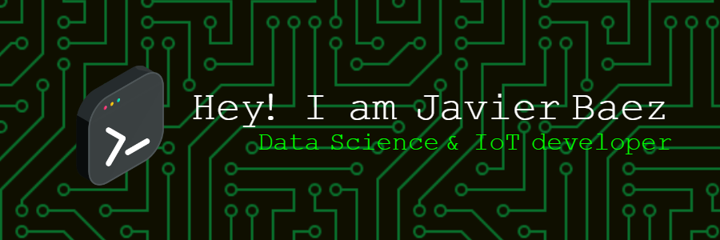

Hi My name is Javier Baez
===================================================================================================================================

* 🧠  I'm learning HTML, CSS, Node.js, JavaScript, Git, GitHub
### 🏠Bienvenido a mi GitHub 

Comunidad y sitios dedicados a compartir conocimientos en programación y diversas  tecnologías. Esto con el proposito de aprender juntos, compartir experiencias, resolver desafíos y ayudar a cada miembro para que alcance sus metas.👍

## Tecnologias 💻

